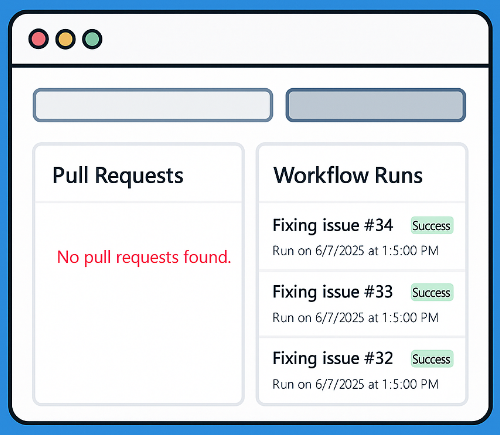

<p align="center">
    
</p>

GitHub at a Glance: Stay informed with a powerful, customizable dashboard for tracking repository activity and status updates in real time.

# GitHub PR & Action Status Dashboard

This project was generated from this prompt in VS Code using agent mode and Claude 3.7

```
i am using the new github copilot code agent 

i created and issue and assigned copilot
it create a PR from the issue and kicks off an action

i want to see the PR update and the action status all in one place
it should refresh every 15 seconds
```

A simple dashboard that shows GitHub PR updates and action statuses in one place, with automatic refreshing every 15 seconds.

## Features

- View all pull requests and their status in one place
- Monitor GitHub Actions workflow runs associated with your repository
- Auto-refreshes data every 15 seconds
- Easy to set up - just enter your repository and GitHub token

## Setup

1. Open `index.html` in your web browser
2. Enter your repository in the format `owner/repo` (e.g., `octocat/Hello-World`)
3. Enter your GitHub Personal Access Token (PAT)
4. Click "Save Settings" to start fetching data

## GitHub Token

To use this dashboard, you'll need a GitHub Personal Access Token with the following permissions:
- `repo` scope (for private repositories)
- `public_repo` scope (for public repositories)

You can create a token from your GitHub account at:
https://github.com/settings/tokens

## Security Note

Your GitHub token is stored in your browser's localStorage. This means it stays on your device and is not sent to any server (other than GitHub's API). However, be careful not to share access to this page with others when your token is saved.

## Local Usage

This dashboard is completely client-side and can be run by simply opening the `index.html` file in a web browser. No server is required.

## Browser Support

This dashboard works in all modern browsers including:
- Chrome
- Firefox
- Edge
- Safari
